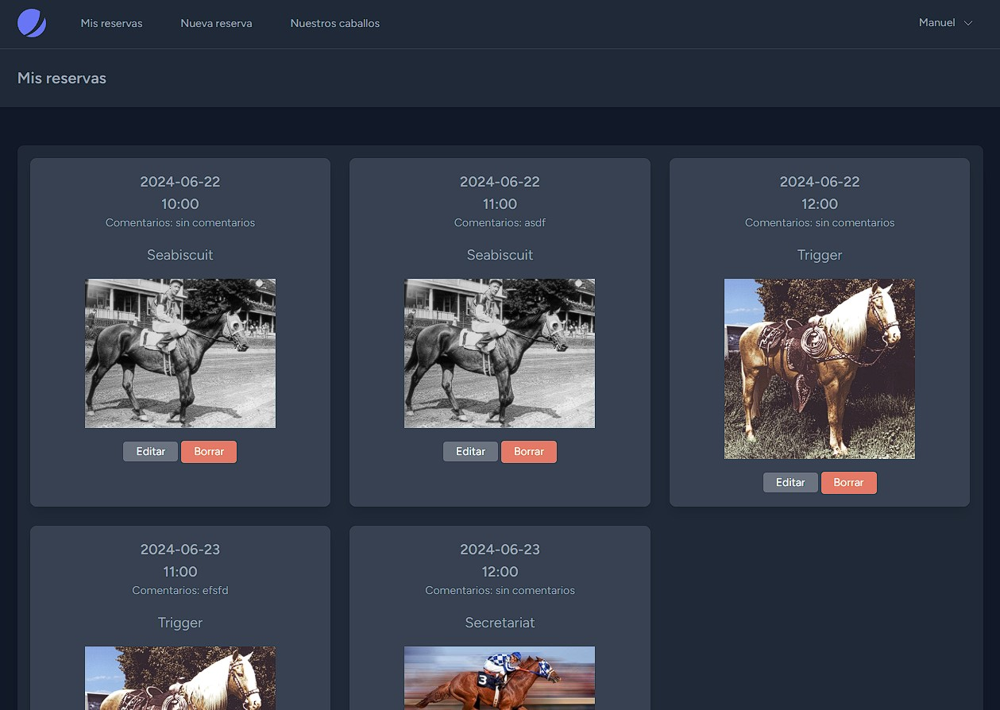
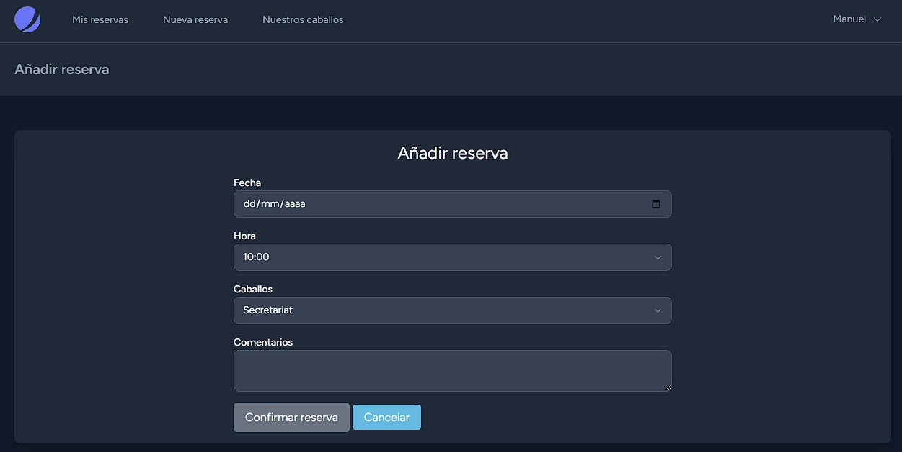
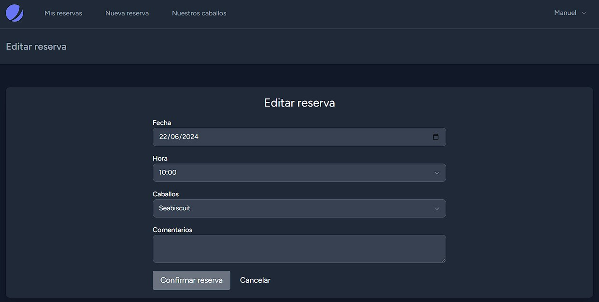
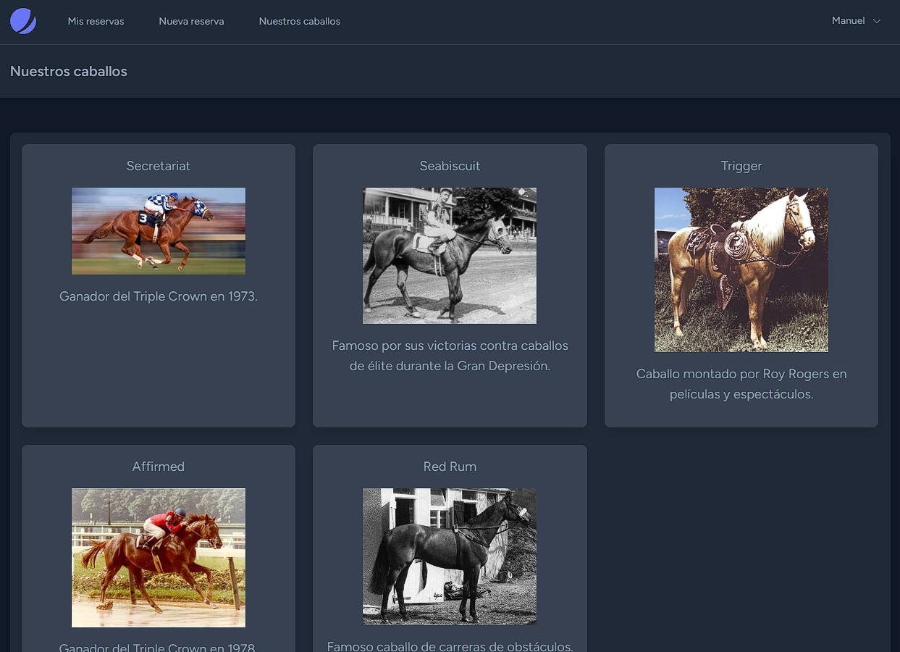
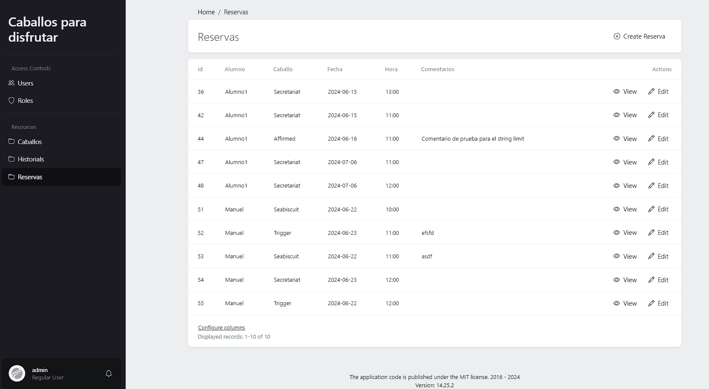

APLICACIÓN PHP

Aplicación web para la gestión de reservas de una escuela de hípica. Este proyecto contiene un API REST usado por la aplicación desarrollada en Kotlin en el repositorio Reservas-hipica-Android.

CAPTURAS

- Mis reservas

- Añadir reserva

- Editar reservas

- Listado de caballos

- Panel de administración

